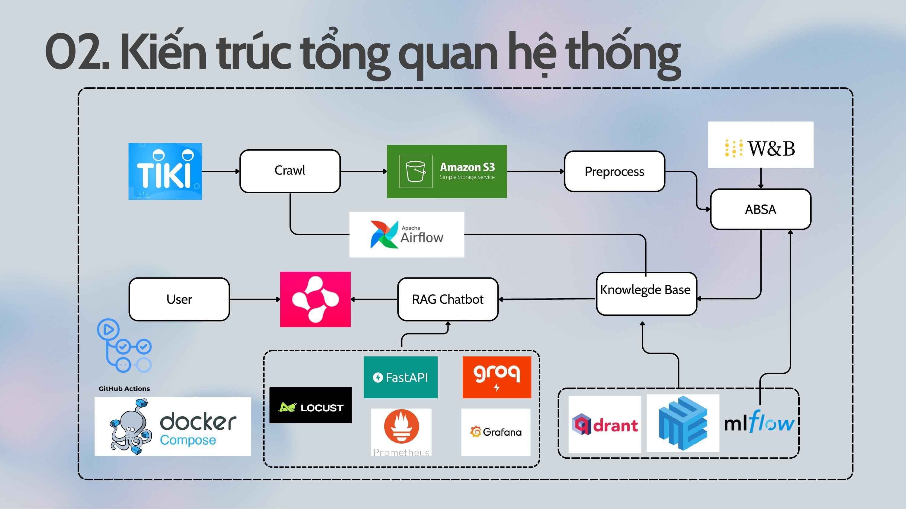
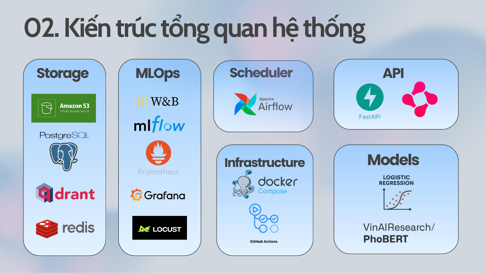
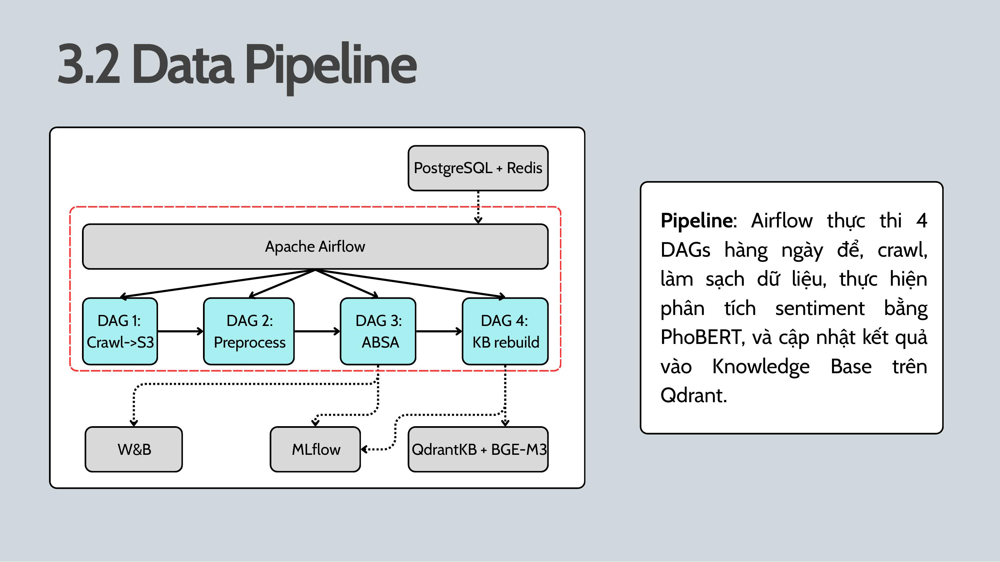
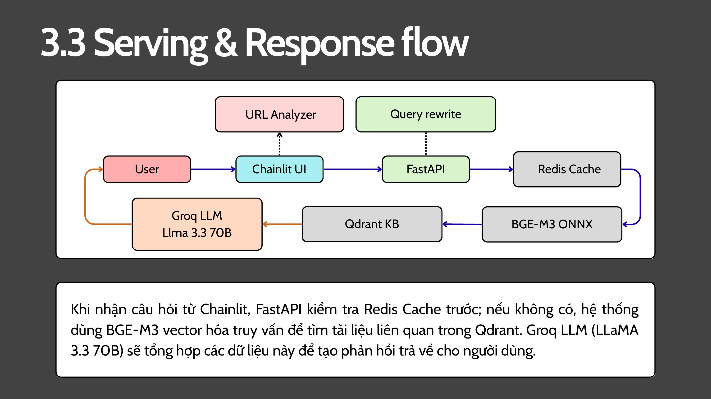

# 🛒 Tiki Sentiment Chatbot

[](https://www.python.org/)
[](https://fastapi.tiangolo.com/)
[](https://airflow.apache.org/)
[](https://www.docker.com/)
[](http://13.251.141.210:8001)
[](https://wandb.ai/cs317-mlops-org)

Hệ thống RAG Chatbot hỏi đáp sản phẩm Tiki kết hợp Aspect-Based Sentiment Analysis (ABSA). Người dùng có thể hỏi tự nhiên về sản phẩm ngành **Nhà cửa & Đời sống**, nhận phân tích cảm xúc theo 6 khía cạnh (chất lượng, giá cả, mô tả, dịch vụ, đóng gói, giao hàng), hoặc paste link sản phẩm Tiki để phân tích real-time.

**Môn học:** CS317 - Phát triển và vận hành hệ thống máy học  
**GVHD:** TS. Đỗ Văn Tiến | **GVTH:** CN. Lê Trần Trọng Khiêm  
**Trường:** Đại học Công nghệ Thông tin - ĐHQG TP.HCM

## 1. Thành viên nhóm 7

| MSSV | Họ và tên | Phụ trách |
|------|-----------|-----------|
| 23521330 | Trần Phi Quyên | Xây dựng module crawl dữ liệu từ Tiki API (product list, product detail, reviews) phục vụ cả luồng bulk ban đầu và incremental hàng ngày (Airflow DAG 1). Thiết lập CI/CD pipeline qua GitHub Actions. Viết báo cáo và slide. |
| 23520439 | Văn Thị Bảo Hân | Xây dựng pipeline gán nhãn ABSA tự động cho toàn bộ dataset ban đầu (~13,000 reviews) dựa trên LLM qua kiến trúc AWS Lambda + SQS; quản lý dữ liệu trên AWS S3, đồng bộ chỉ số lên W&B để giám sát và lưu vết; xây dựng module tiền xử lý phục vụ DAG 2 cho dữ liệu incremental. Viết báo cáo và slide. |
| 23520078 | Trần Nhật Phương Anh | Chuẩn bị dữ liệu ABSA, huấn luyện và tối ưu siêu tham số (Sweep) cho 5 mô hình ABSA (PhoBERT, LogReg, RF, TextCNN, BiGRU), đánh giá hiệu năng, sử dụng W&B để ghi nhận toàn bộ quá trình thí nghiệm. Viết báo cáo. |
| 23520556 | Đoàn Nhật Hưng | Xây dựng RAG Chatbot (FastAPI, Chainlit, hybrid search Qdrant, Redis cache, multi-turn), Airflow DAG 3 & 4, tích hợp PhoBERT ONNX + BGE-M3 ONNX, Prometheus + Grafana monitoring, RAGAS evaluation, Docker Compose 12 services trên server được cấp. **[Thực hành]** AWS EC2 deployment, CloudWatch logging, Grafana alerting → Telegram, CI/CD cloud. |

## 2. Kiến trúc hệ thống



Hệ thống gồm 3 luồng chính hoạt động liên kết với nhau: **Data Pipeline** tự động hóa từ crawl → label → ABSA → cập nhật Knowledge Base; **Serving** xử lý câu hỏi real-time; và **MLOps Infrastructure** đảm bảo tracking, monitoring, CI/CD.



## 3. MLOps Pipeline (Đồ án Lý thuyết)

Toàn bộ phần này được xây dựng và chạy trên server nội bộ được cấp, truy cập qua VPN mạng trường.

### 3.1 Data Processing Pipeline



**Apache Airflow 2.7** với CeleryExecutor, Redis broker, PostgreSQL metadata backend điều phối 4 DAGs chạy tuần tự mỗi ngày:

**DAG 1 — `tiki_only_sync_s3`**  
Crawl dữ liệu từ Tiki API theo 3 module: product list (danh sách sản phẩm theo category), product detail (thông tin chi tiết), reviews (đánh giá người mua). Dữ liệu upload thẳng lên AWS S3 bucket `tiki-crawl-data`, phân chia theo ngày để hỗ trợ cả bulk load lẫn incremental update.

**DAG 2 — `preprocess_pipeline`**  
Download dữ liệu mới từ S3, làm sạch (loại bỏ noise, chuẩn hóa text), chuẩn bị input cho bước ABSA inference. DAG này xử lý dữ liệu incremental hàng ngày — dataset ban đầu (~13,000 reviews) đã được gán nhãn riêng qua AWS Lambda + SQS trong giai đoạn one-time setup.

**DAG 3 — `absa_inference_pipeline`**  
Chạy ABSA inference bằng PhoBERT ONNX trên dữ liệu đã xử lý. Sau inference, kiểm tra 2 điều kiện drift: số review mới ≥ 500 **hoặc** F1 score giảm > 5% so với baseline (0.848). Nếu trigger, ghi flag vào MLflow và gửi W&B alert để team ABSA can thiệp retrain.

**DAG 4 — `kb_rebuild_pipeline`**  
Incremental KB update: embed các documents mới bằng BGE-M3 ONNX → upsert vào Qdrant (xóa vectors cũ của product đó, thêm vectors mới), archive file đã xử lý để tránh reprocess, log metrics (vectors count, documents processed, update duration) vào MLflow.

### 3.2 Model Training & Optimization

5 mô hình ABSA được huấn luyện và so sánh bằng **W&B Hyperparameter Sweep**:

| Model | Avg F1 (macro) | Vai trò |
|-------|----------------|---------|
| **PhoBERT v2** | **84.8%** | ABSA offline trong DAG 3 |
| Logistic Regression | ~72% | ABSA realtime trong URL Analyzer |
| MultiHeadBiGRU | ~70% | Baseline |
| MultiHeadTextCNN | ~68% | Baseline |
| Random Forest | ~65% | Baseline |

PhoBERT config: `lr ∈ {2e-5, 5e-5}`, `batch_size ∈ {16, 32}`, `max_length=128`, `dropout ∈ {0.3, 0.5}`, optimizer AdamW, early stopping patience 5. W&B Model Registry lưu checkpoint tốt nhất.

**ONNX Export:**
- PhoBERT v2: `torch.onnx.export` opset 14, `max_length=128` — giảm latency inference đáng kể so với PyTorch gốc
- BGE-M3: export dense encoder sang ONNX (`bge_m3_dense.onnx`), 1024-dim vectors — dùng ONNX Runtime CPU trong Airflow, không cần GPU

### 3.3 Model Serving



**FastAPI** (port 8000, 2 uvicorn workers) là core của toàn bộ RAG logic:

- Nhận query từ Chainlit → LLM detect intent (chitchat vs product query)
- Với product query: LLM rewrite query theo conversation history → check **Redis cache** (TTL 1hr)
- Cache miss: embed bằng **BGE-M3 ONNX** → **Qdrant hybrid search** (dense cosine + sparse BM25) → Groq LLaMA 3.3 70B sinh response
- **OpenRouter** làm LLM fallback khi Groq hit rate limit (nhiều free models xoay vòng)
- **Smart warm cache on startup**: tự extract brand names, categories, product names từ Qdrant → generate ~100 queries thật → cache trước, giảm cold start từ ~10s xuống ~16ms
- Interaction logging ra `interactions.jsonl` sau mỗi request `/chat`

**Chainlit** (port 8001):
- Multi-turn conversation với session memory
- **URL Analyzer**: nhận link Tiki → crawl realtime → **LogReg ABSA** phân tích 6 khía cạnh → trả kết quả ngay (LogReg được chọn thay PhoBERT vì inference ~1ms so với ~44s cho 100 reviews)
- Settings: người dùng chọn ABSA model (PhoBERT ONNX / LogReg) tùy nhu cầu

**Qdrant Knowledge Base:** 2,962 vectors, collection `tiki_kb`, 3 loại document (product_card, aspect_summary, representative_reviews), metadata filtering theo category và ABSA scores.

### 3.4 Experiment Tracking

**W&B** (org `cs317-mlops-org`) quản lý ABSA training:
- Log tất cả training runs, metrics, artifacts
- Hyperparameter Sweep tự động tìm config tốt nhất
- Model Registry lưu PhoBERT checkpoint tốt nhất
- Alert tự động khi DAG 3 phát hiện drift trigger

**MLflow** (port 5000) track metrics vận hành:
- Experiment `retrain_monitoring`: F1 hiện tại, số reviews mới, trigger flag (từ DAG 3)
- Experiment `kb_update`: vectors count, documents processed, update duration (từ DAG 4)
- Experiment `ragas_evaluation`: RAGAS scores theo từng lần chạy eval

### 3.5 Monitoring

**Prometheus** (port 9090) scrape endpoint `/metrics` từ FastAPI mỗi 15 giây, thu thập `http_requests_total`, `http_request_duration_seconds`, `up`.

**Grafana** (port 3000) hiển thị 4 panels: Request Rate (req/s), Average Response Time (ms), Total Requests, Error Rate (%).

### 3.6 Load Testing & Evaluation

**Locust** (port 8089) load test endpoint `/chat` với 4 user class (NormalUser, PowerUser, StressUser, HealthMonitor). Kết quả: **tối đa 20 concurrent users** tại 0% failure rate. Bottleneck là Groq API rate limit (25 RPM), không phải infrastructure — giảm thiểu bằng Redis cache.

**RAGAS** (20 domain-specific queries):

| Metric | Score |
|--------|-------|
| Faithfulness | 0.494 |
| Answer Relevancy | 0.145 |

Kết quả log vào MLflow experiment `ragas_evaluation`.

### 3.7 CI/CD

GitHub Actions với **self-hosted runner** trên server nội bộ được cấp, trigger khi push lên `main`:

```
git pull → chmod -R 777 data/ → docker-compose build api ui
→ docker-compose up -d → restart airflow/scheduler/worker
→ smoke test API (retry 30 lần × 5s) + UI → ✅ done
```

### 3.8 Infrastructure

12 Docker Compose services trên shared network — server nội bộ được cấp (Ubuntu, 8 CPU, 9.7GB RAM):

| Service | Image | Port |
|---------|-------|------|
| tiki-api | custom FastAPI | 8000 |
| tiki-ui | custom Chainlit | 8001 |
| tiki-qdrant | qdrant/qdrant | 6333 |
| tiki-redis | redis:7-alpine | 6379 |
| tiki-airflow | custom Airflow webserver | 8080 |
| tiki-airflow-scheduler | custom Airflow | — |
| tiki-airflow-worker | custom Airflow | — |
| tiki-airflow-postgres | postgres:15 | 5432 |
| tiki-mlflow | ghcr.io/mlflow/mlflow:v2.11.1 | 5000 |
| tiki-prometheus | prom/prometheus | 9090 |
| tiki-grafana | grafana/grafana | 3000 |
| tiki-locust | locustio/locust | 8089 |

## 4. Bổ sung cho học phần Thực hành

> Các phần dưới đây được **thêm mới hoàn toàn** so với đồ án lý thuyết.  
> Thực hiện bởi: **Đoàn Nhật Hưng — 23520556**

### 4.1 Cloud Infrastructure Deployment (AWS EC2)

Triển khai toàn bộ 12 services lên **AWS EC2 t3.xlarge** (4 vCPU, 16GB RAM, ap-southeast-1 Singapore). Hệ thống từ VPN-only trở thành publicly accessible — bất kỳ ai cũng truy cập được mà không cần VPN. Knowledge Base được migrate từ server nội bộ qua Qdrant snapshot.

- **Demo:** http://13.251.141.210:8001
- **API:** http://13.251.141.210:8000

### 4.2 Cloud Logging (AWS CloudWatch)

Cài **AWS CloudWatch Agent** trên EC2, ship log từ toàn bộ 12 Docker containers lên cloud tự động. Log group `tiki-mlops` (region `ap-southeast-1`) tập trung stdout/stderr của tất cả services — có thể search, filter từ AWS Console mà không cần SSH vào server.

### 4.3 Grafana Alerting → Telegram

Nâng cấp monitoring từ passive (xem dashboard) sang active (tự động cảnh báo). 3 alert rules gửi notification qua Telegram bot:

| Alert | Điều kiện | Pending |
|-------|-----------|---------|
| API Down | `up{job="tiki-api"} < 1` | 1 phút |
| High Error Rate | Error rate > 5% trong 5 phút | 2 phút |
| High Latency | p95 latency > 10s | 2 phút |

### 4.4 CI/CD mở rộng sang Cloud

GitHub Actions tự động deploy lên **cả 2 môi trường** khi push lên `main`:

```
push to main
  └─ Job 1: server nội bộ (self-hosted runner)
       └─ [pass] Job 2: AWS EC2 (appleboy/ssh-action)
                  → check EC2 online trước
                  → online: git pull + build api/ui + restart services
                  → offline: skip, workflow vẫn pass
```

## 5. Hướng dẫn cài đặt

### Yêu cầu hệ thống

| | Tối thiểu | Khuyến nghị |
|-|-----------|------------|
| RAM | 8GB | 16GB |
| Disk | 50GB | 100GB |
| Docker | 24.x + Compose v2 | Latest |
| OS | Ubuntu 20.04 / WSL2 | Ubuntu 22.04 |

### Bước 1 — Clone repo

```bash
git clone https://github.com/phngahn/sentiment-chatbot-mlops
cd sentiment-chatbot-mlops
```

### Bước 2 — Cấu hình môi trường

```bash
cp .env.example .env
```

Điền các biến trong `.env`:

```env
# LLM
GROQ_API_KEY=gsk_...
OPENROUTER_API_KEY=sk-or-...

# AWS S3
AWS_ACCESS_KEY_ID=...
AWS_SECRET_ACCESS_KEY=...
AWS_DEFAULT_REGION=ap-southeast-1
S3_BUCKET_NAME=tiki-crawl-data

# W&B
WANDB_API_KEY=...
WANDB_ENTITY=cs317-mlops-org

# Airflow
AIRFLOW_UID=1000

# Services (giữ nguyên nếu dùng Docker Compose)
MLFLOW_TRACKING_URI=http://tiki-mlflow:5000
QDRANT_HOST=tiki-qdrant
QDRANT_PORT=6333
REDIS_HOST=tiki-redis
REDIS_PORT=6379
```

### Bước 3 — Chuẩn bị ONNX model files

ONNX model files không được commit lên git vì kích thước lớn. Cần đặt đúng cấu trúc:

```
models/
├── absa/
│   └── v2/
│       ├── phobert_onnx/
│       │   └── phobert_absa.onnx       # ~1.5MB
│       └── logreg/
│           ├── logreg_model.pkl
│           └── tfidf_vectorizer.pkl
└── bge-m3-onnx/
    └── bge_m3_dense.onnx               # ~550MB
```

Export lại nếu chưa có:

```bash
python scripts/convert_phobert_onnx.py
python scripts/convert_bgem3_onnx.py
```

### Bước 4 — Build và khởi động

```bash
# Build tất cả custom images (api, ui, airflow)
docker compose build

# Khởi động toàn bộ 12 services
docker compose up -d

# Kiểm tra tất cả đang Up
docker compose ps
```

Đợi 2-3 phút để services sẵn sàng, đặc biệt `tiki-api` cần load ONNX models và warm cache.

### Bước 5 — Khởi tạo Knowledge Base

**Cách nhanh — restore từ Qdrant snapshot** (chạy trên máy đang host Docker):

```bash
curl -X POST "http://[SERVER_IP]:6333/collections/tiki_kb/snapshots/upload?priority=snapshot" \
  -H "Content-Type: multipart/form-data" \
  -F "snapshot=@tiki_kb.snapshot"

# Kiểm tra
curl -s http://[SERVER_IP]:6333/collections/tiki_kb | \
  python3 -c "import sys,json; r=json.load(sys.stdin)['result']; print(f'Status: {r[\"status\"]}, Vectors: {r[\"points_count\"]}')"
# → Status: green, Vectors: 2962
```

**Cách đầy đủ — chạy pipeline qua Airflow** (cần S3 data):

Vào Airflow UI `http://[SERVER_IP]:8080`, trigger thủ công lần lượt: DAG 1 → DAG 2 → DAG 3 → DAG 4.

## 6. Kiểm thử

> Thay `[SERVER_IP]` bằng IP server nội bộ (VPN) hoặc `13.251.141.210` (cloud). Các lệnh `docker exec` và `docker compose` cần chạy trực tiếp trên máy đang host Docker.

### Health check

```bash
# API
curl http://[SERVER_IP]:8000/health
# → {"status":"ok"}

# Qdrant vectors count
curl -s http://[SERVER_IP]:6333/collections/tiki_kb | \
  python3 -c "import sys,json; print(json.load(sys.stdin)['result']['points_count'])"
# → 2962

# Redis (chạy trên Docker host)
docker exec tiki-redis redis-cli PING
# → PONG
```

### Test chatbot

```bash
# Câu hỏi thông thường
curl -X POST http://[SERVER_IP]:8000/chat \
  -H "Content-Type: application/json" \
  -d '{"query": "Nồi cơm điện nào tốt nhất?", "session_id": "test-001"}'

# Multi-turn (cùng session_id)
curl -X POST http://[SERVER_IP]:8000/chat \
  -H "Content-Type: application/json" \
  -d '{"query": "So sánh với máy hút bụi thì sao?", "session_id": "test-001"}'

# URL Analyzer
curl -X POST http://[SERVER_IP]:8000/chat \
  -H "Content-Type: application/json" \
  -d '{"query": "https://tiki.vn/noi-com-dien-abc", "session_id": "test-002"}'
```

### RAGAS evaluation (chạy trên Docker host)

```bash
docker exec tiki-api python /app/scripts/ragas_eval.py
# Kết quả log vào MLflow → http://[SERVER_IP]:5000
```

### Load testing

```bash
# Qua Locust UI
open http://[SERVER_IP]:8089

# Headless (20 users, 2 phút) — chạy trên Docker host
docker compose exec locust locust \
  --headless -u 20 -r 2 --run-time 120s \
  --host http://tiki-api:8000
```

### Kiểm tra Airflow DAGs (chạy trên Docker host)

```bash
# Xem logs
docker compose logs tiki-airflow --tail=50

# Vào UI để trigger/monitor
open http://[SERVER_IP]:8080  # admin/admin
```

### Kiểm tra CloudWatch logs (cloud only)

```bash
aws logs describe-log-groups --region ap-southeast-1

aws logs filter-log-events \
  --log-group-name tiki-mlops \
  --filter-pattern "ERROR" \
  --region ap-southeast-1 \
  --limit 20
```

## 7. Truy cập services

| Service | Server nội bộ (VPN mạng trường) | Cloud (AWS EC2) | Credentials |
|---------|----------------------------------|-----------------|-------------|
| Chatbot UI | http://[server-ip]:8001 | http://13.251.141.210:8001 | — |
| API Docs | http://[server-ip]:8000/docs | http://13.251.141.210:8000/docs | — |
| Airflow | http://[server-ip]:8080 | SSH tunnel* | admin/admin |
| Grafana | http://[server-ip]:3000 | http://13.251.141.210:3000 | admin/admin |
| MLflow | http://[server-ip]:5000 | SSH tunnel* | — |
| Prometheus | http://[server-ip]:9090 | SSH tunnel* | — |
| Locust | http://[server-ip]:8089 | SSH tunnel* | — |

*SSH tunnel để truy cập service nội bộ trên cloud:
```bash
ssh -i your-key.pem -L 8080:localhost:8080 -L 5000:localhost:5000 ubuntu@13.251.141.210
```

## 8. Cấu trúc thư mục

```
sentiment-chatbot-mlops/
├── src/
│   ├── chatbot/
│   │   ├── api.py              # FastAPI, warm cache, interaction logging
│   │   ├── retrieval.py        # Hybrid search, Redis cache
│   │   ├── llm.py              # Groq/OpenRouter, query rewriting, intent detection
│   │   └── chatbot_ui.py       # Chainlit UI, URL Analyzer, multi-turn
│   ├── absa/
│   │   └── inference.py        # PhoBERT ONNX + LogReg predictor
│   ├── crawling/               # Tiki crawler modules
│   └── kb/
│       ├── index_qdrant.py     # Full KB rebuild
│       └── index_qdrant_delta.py # Incremental update
├── dags/                       # 4 Airflow DAGs
├── scripts/
│   ├── convert_phobert_onnx.py
│   ├── convert_bgem3_onnx.py
│   └── ragas_eval.py
├── models/                     # ONNX model files (gitignored)
├── monitoring/                 # Prometheus config
├── docker/                     # Dockerfiles
├── tests/                      # Locust load test scripts
├── docs/images/                # Architecture diagrams
├── .github/workflows/
│   └── deploy.yml              # CI/CD: server nội bộ + AWS EC2
└── docker-compose.yml
```

## 9. Limitations

- **Domain hạn chế:** Knowledge Base chỉ chứa sản phẩm ngành Nhà cửa & Đời sống (~2,962 sản phẩm). Câu hỏi ngoài domain sẽ có chất lượng trả lời thấp hơn.
- **Rate limit:** Groq API giới hạn 25 RPM — bottleneck thực khi nhiều user đồng thời. Redis cache và OpenRouter fallback giảm thiểu nhưng không triệt tiêu.
- **PhoBERT retraining:** Cần GPU để train lại, hiện dùng human-in-the-loop — DAG 3 phát hiện drift và gửi W&B alert để team can thiệp thủ công.

## License

MIT License — CS317 Group 7, UIT 2026
